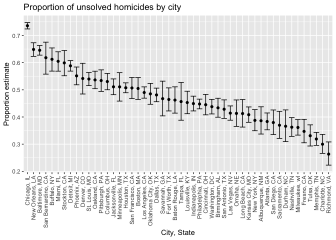
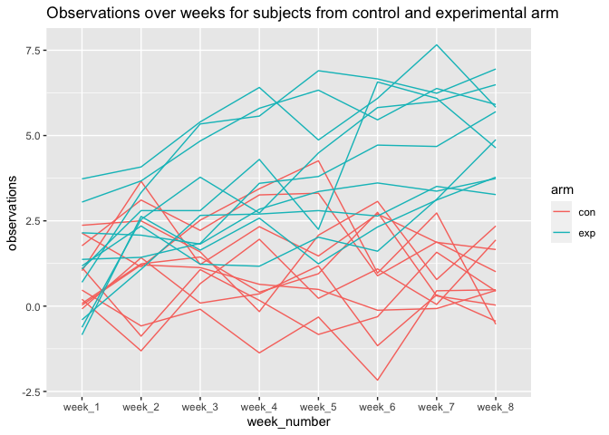

P8105 Homework 5 \[td2704\]
================

## Problem 1

``` r
homicide_data = read_csv("data/homicide-data.csv", na = c("", "Unknown"))
```

    ## Rows: 52179 Columns: 12

    ## ── Column specification ────────────────────────────────────────────────────────
    ## Delimiter: ","
    ## chr (8): uid, victim_last, victim_first, victim_race, victim_sex, city, stat...
    ## dbl (4): reported_date, victim_age, lat, lon

    ## 
    ## ℹ Use `spec()` to retrieve the full column specification for this data.
    ## ℹ Specify the column types or set `show_col_types = FALSE` to quiet this message.

``` r
homicide_data
```

    ## # A tibble: 52,179 × 12
    ##    uid        reported_date victim_last  victim_first victim_race victim_age
    ##    <chr>              <dbl> <chr>        <chr>        <chr>            <dbl>
    ##  1 Alb-000001      20100504 GARCIA       JUAN         Hispanic            78
    ##  2 Alb-000002      20100216 MONTOYA      CAMERON      Hispanic            17
    ##  3 Alb-000003      20100601 SATTERFIELD  VIVIANA      White               15
    ##  4 Alb-000004      20100101 MENDIOLA     CARLOS       Hispanic            32
    ##  5 Alb-000005      20100102 MULA         VIVIAN       White               72
    ##  6 Alb-000006      20100126 BOOK         GERALDINE    White               91
    ##  7 Alb-000007      20100127 MALDONADO    DAVID        Hispanic            52
    ##  8 Alb-000008      20100127 MALDONADO    CONNIE       Hispanic            52
    ##  9 Alb-000009      20100130 MARTIN-LEYVA GUSTAVO      White               56
    ## 10 Alb-000010      20100210 HERRERA      ISRAEL       Hispanic            43
    ## # … with 52,169 more rows, and 6 more variables: victim_sex <chr>, city <chr>,
    ## #   state <chr>, lat <dbl>, lon <dbl>, disposition <chr>

The raw homicide data has 52179 rows and 12 columns with variables uid,
reported\_date, victim\_last, victim\_first, victim\_race, victim\_age,
victim\_sex, city, state, lat, lon, disposition.

``` r
homicide_data_modified = 
  homicide_data %>%
  mutate(
    city_state = paste(city,state,sep = ", ")
  )
homicide_data_modified
```

    ## # A tibble: 52,179 × 13
    ##    uid        reported_date victim_last  victim_first victim_race victim_age
    ##    <chr>              <dbl> <chr>        <chr>        <chr>            <dbl>
    ##  1 Alb-000001      20100504 GARCIA       JUAN         Hispanic            78
    ##  2 Alb-000002      20100216 MONTOYA      CAMERON      Hispanic            17
    ##  3 Alb-000003      20100601 SATTERFIELD  VIVIANA      White               15
    ##  4 Alb-000004      20100101 MENDIOLA     CARLOS       Hispanic            32
    ##  5 Alb-000005      20100102 MULA         VIVIAN       White               72
    ##  6 Alb-000006      20100126 BOOK         GERALDINE    White               91
    ##  7 Alb-000007      20100127 MALDONADO    DAVID        Hispanic            52
    ##  8 Alb-000008      20100127 MALDONADO    CONNIE       Hispanic            52
    ##  9 Alb-000009      20100130 MARTIN-LEYVA GUSTAVO      White               56
    ## 10 Alb-000010      20100210 HERRERA      ISRAEL       Hispanic            43
    ## # … with 52,169 more rows, and 7 more variables: victim_sex <chr>, city <chr>,
    ## #   state <chr>, lat <dbl>, lon <dbl>, disposition <chr>, city_state <chr>

``` r
homicide_counts_df = 
  homicide_data_modified %>%
  group_by(city_state, disposition) %>%
  summarise(
    homicides_by_disposition = n()
  ) %>%
  group_by(city_state) %>%
  mutate(
    total_num_homicides = sum(homicides_by_disposition)
  ) %>%
  filter(disposition == "Closed without arrest" | disposition == "Open/No arrest") %>%
  group_by(city_state) %>%
  mutate(
    num_unsolved_homicides = sum(homicides_by_disposition)
  ) %>%
  select(city_state, total_num_homicides, num_unsolved_homicides) %>%
  distinct(city_state, total_num_homicides, num_unsolved_homicides)
```

    ## `summarise()` has grouped output by 'city_state'. You can override using the `.groups` argument.

``` r
homicide_counts_df
```

    ## # A tibble: 50 × 3
    ## # Groups:   city_state [50]
    ##    city_state      total_num_homicides num_unsolved_homicides
    ##    <chr>                         <int>                  <int>
    ##  1 Albuquerque, NM                 378                    146
    ##  2 Atlanta, GA                     973                    373
    ##  3 Baltimore, MD                  2827                   1825
    ##  4 Baton Rouge, LA                 424                    196
    ##  5 Birmingham, AL                  800                    347
    ##  6 Boston, MA                      614                    310
    ##  7 Buffalo, NY                     521                    319
    ##  8 Charlotte, NC                   687                    206
    ##  9 Chicago, IL                    5535                   4073
    ## 10 Cincinnati, OH                  694                    309
    ## # … with 40 more rows

For Baltimore, MD:

``` r
baltimore_data = 
  homicide_counts_df %>%
  filter(city_state == "Baltimore, MD")

baltimore_prop_test = 
  prop.test(
    x = pull(baltimore_data, num_unsolved_homicides),
    n = pull(baltimore_data, total_num_homicides)
    )

baltimore_prop_test
```

    ## 
    ##  1-sample proportions test with continuity correction
    ## 
    ## data:  pull(baltimore_data, num_unsolved_homicides) out of pull(baltimore_data, total_num_homicides), null probability 0.5
    ## X-squared = 239.01, df = 1, p-value < 2.2e-16
    ## alternative hypothesis: true p is not equal to 0.5
    ## 95 percent confidence interval:
    ##  0.6275625 0.6631599
    ## sample estimates:
    ##         p 
    ## 0.6455607

``` r
baltimore_prop_test %>%
  broom::tidy() %>%
  select(estimate, conf.low, conf.high)
```

    ## # A tibble: 1 × 3
    ##   estimate conf.low conf.high
    ##      <dbl>    <dbl>     <dbl>
    ## 1    0.646    0.628     0.663

Let’s make what we did for Baltimore, MD into a function so that we can
apply this across all cities in our df.

``` r
prop_test_city_function = function(city) {
  city_data = 
    homicide_counts_df %>%
    filter(city_state == city)
  
  city_prop_test = 
    prop.test(
      x = pull(city_data, num_unsolved_homicides),
      n = pull(city_data, total_num_homicides)
    )
  
  return(city_prop_test)
}
```

Apply this function to all cities in homicide\_counts\_df.

``` r
test_on_all_cities_df = 
  homicide_counts_df %>%
  mutate(
    test_results = map(city_state, prop_test_city_function),
    tidy_results = map(test_results, broom::tidy)
  ) %>%
  select(city_state, tidy_results) %>%
  unnest(tidy_results) %>%
  select(city_state, estimate, conf.low, conf.high)

test_on_all_cities_df
```

    ## # A tibble: 50 × 4
    ## # Groups:   city_state [50]
    ##    city_state      estimate conf.low conf.high
    ##    <chr>              <dbl>    <dbl>     <dbl>
    ##  1 Albuquerque, NM    0.386    0.337     0.438
    ##  2 Atlanta, GA        0.383    0.353     0.415
    ##  3 Baltimore, MD      0.646    0.628     0.663
    ##  4 Baton Rouge, LA    0.462    0.414     0.511
    ##  5 Birmingham, AL     0.434    0.399     0.469
    ##  6 Boston, MA         0.505    0.465     0.545
    ##  7 Buffalo, NY        0.612    0.569     0.654
    ##  8 Charlotte, NC      0.300    0.266     0.336
    ##  9 Chicago, IL        0.736    0.724     0.747
    ## 10 Cincinnati, OH     0.445    0.408     0.483
    ## # … with 40 more rows

Now that we have our proportion estimates and CIs for each city, let’s
plot them.

``` r
test_on_all_cities_df %>%
  ggplot(aes(x=fct_reorder(city_state, desc(estimate)), y=estimate)) +
  geom_point() +
  geom_errorbar(aes(ymin=conf.low,ymax=conf.high)) +
  theme(axis.text.x = element_text(angle=90, vjust = 0.5, hjust = 1)) +
  xlab("City, State") +
  ylab("Proportion estimate") +
  ggtitle("Proportion of unsolved homicides by city")
```

<!-- -->

## Problem 2

Let’s take a look at data from this longitudinal study.

``` r
experiment_df = 
  tibble(
    files = list.files("data/zip_data/")
    ) %>%
  mutate(
    read_data = purrr::map(str_c("data/zip_data/",files),read_csv)
  ) %>%
  unnest(cols = read_data) %>%
  mutate(
    subject = substr(files,1,6),
    arm = substr(files,1,3)
  ) %>%
  relocate(subject, arm)

experiment_df
```

    ## # A tibble: 20 × 11
    ##    subject arm   files   week_1 week_2 week_3 week_4 week_5 week_6 week_7 week_8
    ##    <chr>   <chr> <chr>    <dbl>  <dbl>  <dbl>  <dbl>  <dbl>  <dbl>  <dbl>  <dbl>
    ##  1 con_01  con   con_01…   0.2   -1.31   0.66   1.96   0.23   1.09   0.05   1.94
    ##  2 con_02  con   con_02…   1.13  -0.88   1.07   0.17  -0.83  -0.31   1.58   0.44
    ##  3 con_03  con   con_03…   1.77   3.11   2.22   3.26   3.31   0.89   1.88   1.01
    ##  4 con_04  con   con_04…   1.04   3.66   1.22   2.33   1.47   2.7    1.87   1.66
    ##  5 con_05  con   con_05…   0.47  -0.58  -0.09  -1.37  -0.32  -2.17   0.45   0.48
    ##  6 con_06  con   con_06…   2.37   2.5    1.59  -0.16   2.08   3.07   0.78   2.35
    ##  7 con_07  con   con_07…   0.03   1.21   1.13   0.64   0.49  -0.12  -0.07   0.46
    ##  8 con_08  con   con_08…  -0.08   1.42   0.09   0.36   1.18  -1.16   0.33  -0.44
    ##  9 con_09  con   con_09…   0.08   1.24   1.44   0.41   0.95   2.75   0.3    0.03
    ## 10 con_10  con   con_10…   2.14   1.15   2.52   3.44   4.26   0.97   2.73  -0.53
    ## 11 exp_01  exp   exp_01…   3.05   3.67   4.84   5.8    6.33   5.46   6.38   5.91
    ## 12 exp_02  exp   exp_02…  -0.84   2.63   1.64   2.58   1.24   2.32   3.11   3.78
    ## 13 exp_03  exp   exp_03…   2.15   2.08   1.82   2.84   3.36   3.61   3.37   3.74
    ## 14 exp_04  exp   exp_04…  -0.62   2.54   3.78   2.73   4.49   5.82   6      6.49
    ## 15 exp_05  exp   exp_05…   0.7    3.33   5.34   5.57   6.9    6.66   6.24   6.95
    ## 16 exp_06  exp   exp_06…   3.73   4.08   5.4    6.41   4.87   6.09   7.66   5.83
    ## 17 exp_07  exp   exp_07…   1.18   2.35   1.23   1.17   2.02   1.61   3.13   4.88
    ## 18 exp_08  exp   exp_08…   1.37   1.43   1.84   3.6    3.8    4.72   4.68   5.7 
    ## 19 exp_09  exp   exp_09…  -0.4    1.08   2.66   2.7    2.8    2.64   3.51   3.27
    ## 20 exp_10  exp   exp_10…   1.09   2.8    2.8    4.3    2.25   6.57   6.09   4.64

Now let’s create a spaghetti plot showing observations on each subject
over time.

``` r
experiment_df %>%
  pivot_longer(
    week_1:week_8,
    names_to = "week_number",
    values_to = "observations"
  ) %>%
  ggplot(aes(x=week_number,y=observations)) +
  geom_line(aes(group=subject,color=arm)) +
  ggtitle("Observations over weeks for subjects from control and experimental arm")
```

<!-- -->

As we can see by the spaghetti plots above, grouped by control and
experimental arms, the observations for subjects from the experimental
arm increased over the weeks while it seems as though observations for
subjects from the control arm stay roughly the same over time. There is
some variability among subjects in both of the arms of the study, but
overall, we notice an increasing trend over time for the experimental
arm and fairly flat trend for the control arm.

## Problem 3

First, we introduce NA values to the dataset.

``` r
set.seed(10)

iris_with_missing = iris %>% 
  map_df(~replace(.x, sample(1:150, 20), NA)) %>%
  mutate(Species = as.character(Species))

iris_with_missing
```

    ## # A tibble: 150 × 5
    ##    Sepal.Length Sepal.Width Petal.Length Petal.Width Species
    ##           <dbl>       <dbl>        <dbl>       <dbl> <chr>  
    ##  1          5.1         3.5          1.4         0.2 setosa 
    ##  2          4.9         3            1.4         0.2 setosa 
    ##  3          4.7         3.2          1.3         0.2 setosa 
    ##  4          4.6         3.1          1.5        NA   setosa 
    ##  5          5           3.6          1.4         0.2 setosa 
    ##  6          5.4         3.9          1.7         0.4 setosa 
    ##  7         NA           3.4          1.4         0.3 setosa 
    ##  8          5           3.4          1.5         0.2 setosa 
    ##  9          4.4         2.9          1.4         0.2 setosa 
    ## 10          4.9         3.1         NA           0.1 setosa 
    ## # … with 140 more rows

Now we create a function to fill in these missing values based on
numeric or character vector.

``` r
fill_in_missing = function(vector) {
  if (is.numeric(vector)) {
    mean_vec = mean(vector, na.rm = TRUE)
    vector = replace_na(vector,mean_vec)
  }
  if (is.character(vector)) {
    vector = replace_na(vector,"virginica")
  }
  return(vector)
}
```

Apply this function to each column of the dataframe.

``` r
iris_fill_in_missing = 
  iris_with_missing %>%
  map_df(fill_in_missing)

iris_fill_in_missing
```

    ## # A tibble: 150 × 5
    ##    Sepal.Length Sepal.Width Petal.Length Petal.Width Species
    ##           <dbl>       <dbl>        <dbl>       <dbl> <chr>  
    ##  1         5.1          3.5         1.4         0.2  setosa 
    ##  2         4.9          3           1.4         0.2  setosa 
    ##  3         4.7          3.2         1.3         0.2  setosa 
    ##  4         4.6          3.1         1.5         1.19 setosa 
    ##  5         5            3.6         1.4         0.2  setosa 
    ##  6         5.4          3.9         1.7         0.4  setosa 
    ##  7         5.82         3.4         1.4         0.3  setosa 
    ##  8         5            3.4         1.5         0.2  setosa 
    ##  9         4.4          2.9         1.4         0.2  setosa 
    ## 10         4.9          3.1         3.77        0.1  setosa 
    ## # … with 140 more rows

``` r
sum(is.na(iris_with_missing))
```

    ## [1] 100

``` r
sum(is.na(iris_fill_in_missing)) # check that all na values were successfully  replaced
```

    ## [1] 0

``` r
mean(pull(iris_with_missing,Sepal.Length),na.rm = TRUE) # check that correct value was replaced
```

    ## [1] 5.819231
